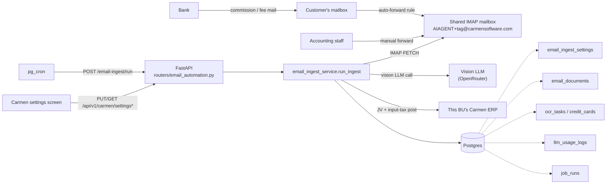
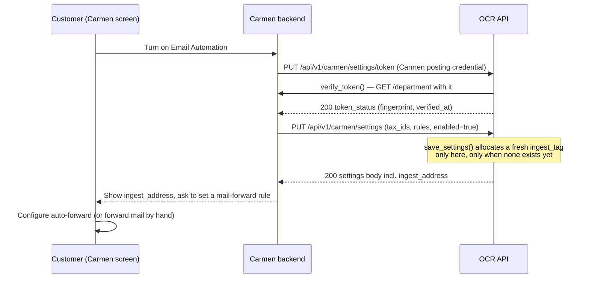
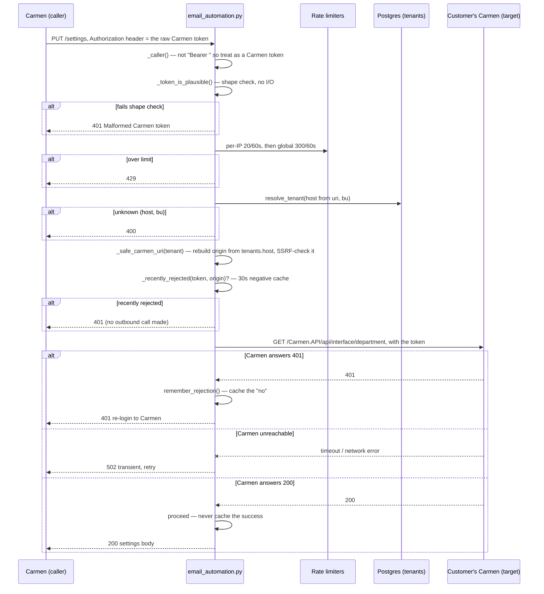
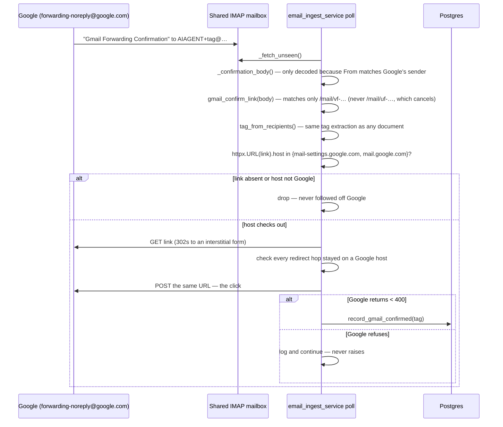
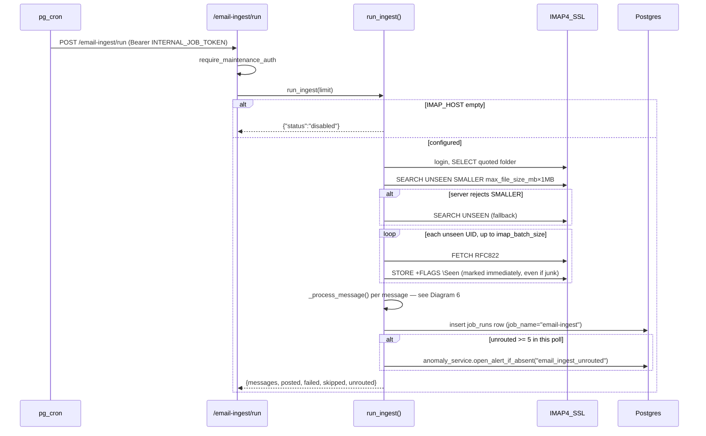
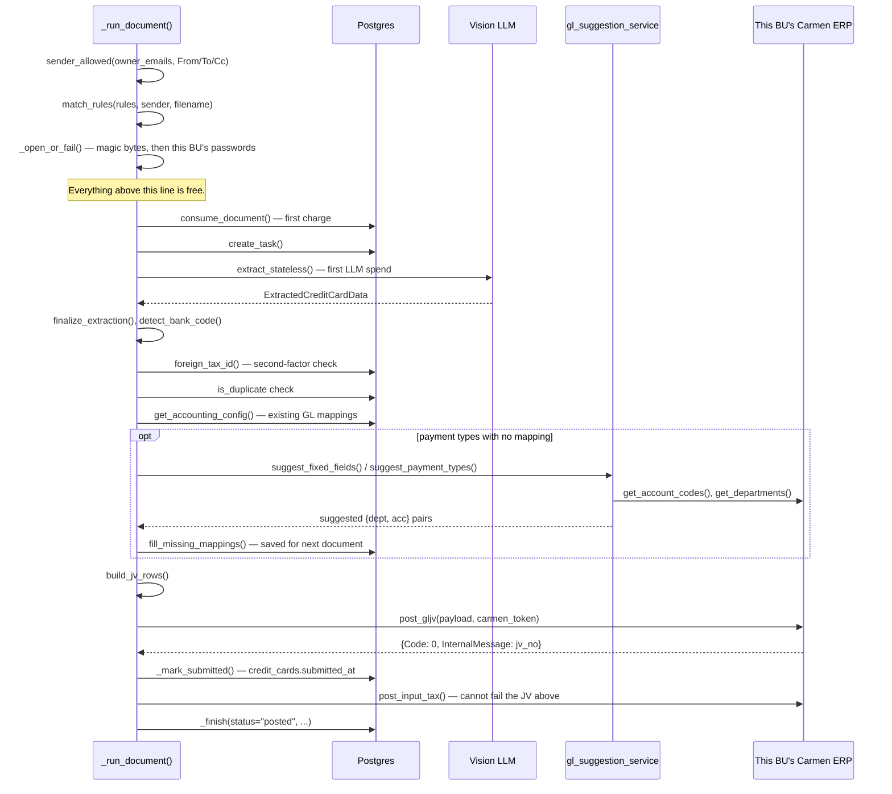
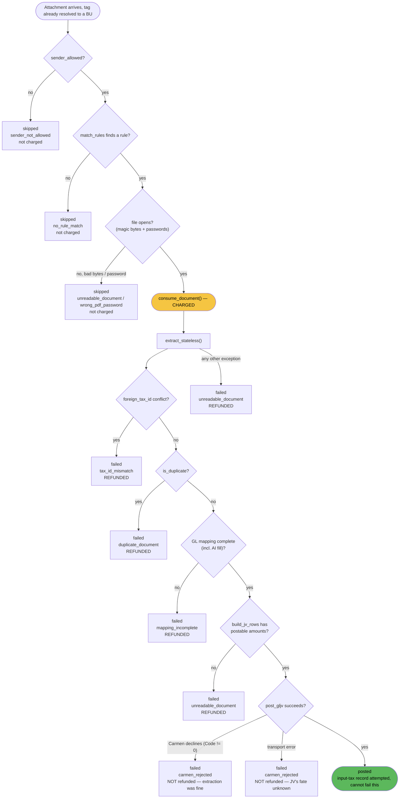
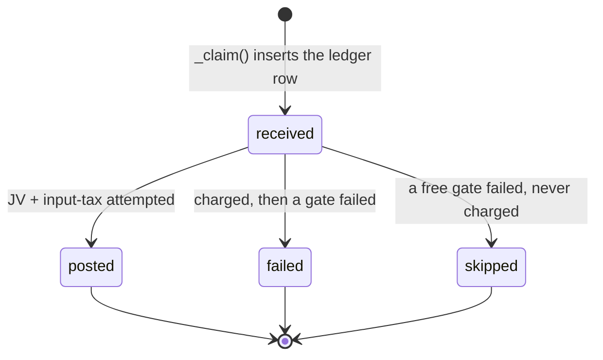

# Architecture

This is the centrepiece of the folder — how the pieces fit together and what happens, in
order, for every flow the feature supports. Diagrams use Mermaid (rendered natively by
GitHub and VS Code's Markdown preview); `docs/Software_Requirements_Specification.md`
already uses the same notation elsewhere in this repo.

## Diagram 1 — component map

## Diagram 2 — onboarding

The entire customer-facing setup, driven from Carmen's own screen — this app has no UI for
any of it except the internal test surface at `#/email-settings`
(see [Frontend surface](#frontend-surface)).

## Diagram 3 — Settings API auth: proof, not assertion

Every settings call is authenticated with the *customer's own* Carmen token, verified
against that customer's own Carmen — not a key we issue. This diagram is worth reading
closely before touching `_caller`, `_resolve`, or `_safe_carmen_uri`.

Successes are never cached, on purpose — a token Carmen accepts today may be revoked a
minute later, and a stale "yes" would be a security hole. A stale "no" costs nothing: a
real user re-authenticates and gets a different token.

## Diagram 4 — Gmail forwarding handshake

Setting up an auto-forward in Gmail is normally a two-party handshake: Google emails the
*destination* mailbox and asks it to confirm. The destination here is the shared ingest
mailbox, which no customer can open — so without this, it's the one step of an otherwise
self-service setup that needs a support call. The poll completes it instead.

Kept for completeness but effectively dead: `gmail_confirm_code()` still parses
`(#123456789)` out of the subject, but measured against four real confirmation mails on
2026-08-07, Google no longer prints one — only the link. `GET /settings` still returns the
`gmail_confirm` field; expect it `null` forever.

## Diagram 5 — one poll

## Diagram 6 — one document, happy path

The exact order from `_run_document()` (`email_ingest_service.py:675`). This ordering is
deliberate — every step before "first charge" is free, and everything before "first LLM
spend" is a database read, not a network call to a model.

## Diagram 7 — gate ladder and the cost boundary

Every exit from `_run_document()`, and the one distinction that matters most: whether a
credit had already been charged when the exit happened. This is the diagram that prevents
the next bug in this feature — get the charged/refund/status triple wrong here and either
a customer is charged for nothing, or a document silently never posts.

The rule stated once: **pre-charge exits are the customer's own configuration saying "not
this file"**, and file as `skipped` — never `failed`, because a failed row would put a red
line on Carmen's screen for what might just be a signature logo in a forwarded chain.
**A Carmen decline is never refunded**, because the extraction itself was fine — only the
ERP's business rules rejected it. **A transport failure is never refunded**, because the
JV's fate is unknown; refunding could double-post if it actually went through.

## Diagram 8 — ledger state machine

All three are terminal. There is no retry sweep — `attempts` is always written as `1`
(`ponytail` note, `email_ingest_service.py:35`); a failed document needs a human to
re-forward it, or a retry job to be built when real failure volume justifies it
(see [05-operations.md](05-operations.md#known-gaps--roadmap)).

## Trust model of mail headers

Routing reads three delivery headers plus a `Received:` fallback (`_DELIVERY_HEADERS`,
`_RECEIVED_FOR`, `email_ingest_service.py:119-132`) — **never `To:`**. On an auto-forward,
`To:` is still the *customer's own mailbox address*, not the ingest address, because a
forward preserves the original envelope's display headers. Reading it would route every
real auto-forward nowhere.

`Delivered-To` is not guaranteed either: measured against the live dev mailbox on
2026-08-06, Gmail omits it entirely when sender and recipient are the same account — mail
is accepted at submission and never traverses the inbound MX hop that stamps it. The
`Received: … for <addr>` fallback caught the tagged address in that case. Both sources
share the same trust level: they're written by a mail *server*, not by whoever composed
the message — which is exactly the distinction that keeps `To:`, `From:` and `Cc:` out of
routing and reserves them for the weaker `owner_emails` gate instead.

**The tag is a capability, not a secret to protect at all costs — but it isn't public
either.** Knowing it lets someone attribute a file to that BU; it does not let them post
anything by itself, because the file still has to pass the rule gate, the tax-ID check, and
Carmen's own validation. It's 8 random hex characters, never derived from the BU code, so
it isn't a guessable dictionary attack surface.

## Context propagation

A cron job has no HTTP request, so nothing has populated the ContextVars that
`carmen_service`, `consume_document`, `assert_module_enabled` and `log_llm_usage` normally
read from request middleware. `_process_attachment()` sets `current_tenant_id` and
`current_carmen_uri` itself before calling into the shared pipeline, and resets them in a
`finally` (`email_ingest_service.py:654-672`). Anyone adding a new step to the pipeline that
calls shared service code needs to know these vars exist and are already set — don't thread
`tenant_id` through as an extra parameter where the rest of the codebase reads it from context.

## Two dedupe keys, two different things

| Key | Catches | Where |
|---|---|---|
| `(tenant_id, message_id, attachment)` unique index | The same **mail** processed twice (a re-delivered or re-polled message) | `_claim()`, `email_ingest_service.py:1043` |
| `credit_cards.submitted_at` + partial unique `(tenant, bank_code, doc_no) WHERE submitted_at IS NOT NULL` | The same **document** arriving in two different mails (e.g. forwarded automatically *and* by hand) | `_mark_submitted()`, `email_ingest_service.py:1068`; `is_duplicate` check upstream in `finalize_extraction` |

Both exist because they answer different questions. The ledger key is checked first and is
free; the document key can only be known after extraction, since it depends on the printed
document number.

## Frontend surface

`#/email-settings` (`frontend/src/pages/EmailSettings.tsx`) is an internal test surface, not
a customer-facing screen — per `../CARMEN_INTEGRATION.md §0`, *"the OCR app has no settings
UI for this feature"*; Carmen's own screen is where customers configure it. Three things
about it are deliberate:

- **Not linked from Home** — reachable by URL only (`frontend/src/main.tsx:232-235`,
  explicit comment: *"deliberately not linked from Home while it is a test surface"*).
- **English-only** — `EmailSettings.tsx:14`, *"this is an internal surface"*, unlike the
  bilingual customer-facing purchase flow and admin dashboard.
- **Bypasses `apiFetch`** (`lib/api/emailAutomation.ts:108-128`) — it sends the raw Carmen
  token with no `Bearer` scheme, matching exactly what `_caller()` expects and what Carmen
  itself sends. A 401 here means *Carmen* rejected the token, which the page renders
  inline; going through the shared `apiFetch` would instead treat a 401 as "our own session
  died" and wipe the OCR session.

There is no admin UI at all for this feature — see
[05-operations.md #known-gaps](05-operations.md#known-gaps--roadmap).

## Not built

Outbound SMTP does not exist anywhere in this codebase. `scripts/email_ingest_e2e.py`
constructs an `email.message.EmailMessage` and delivers it with IMAP `APPEND` (so it can
also write a `Delivered-To` header), not SMTP — it is a test fixture, not a send path. The
proposed webhook events in `../CARMEN_INTEGRATION.md §3` (`document.posted`,
`document.failed`) are similarly unbuilt; nothing in this repo issues an HMAC-signed
outbound POST to Carmen.
